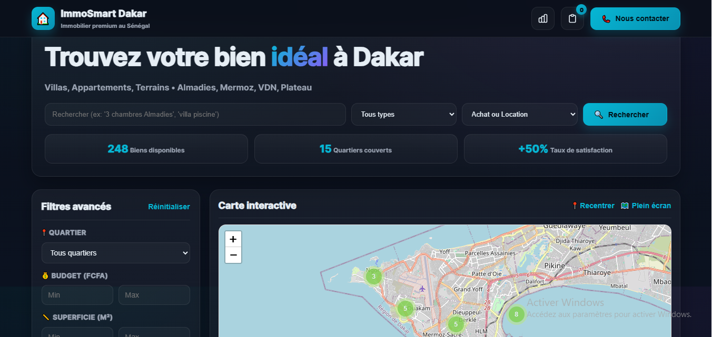
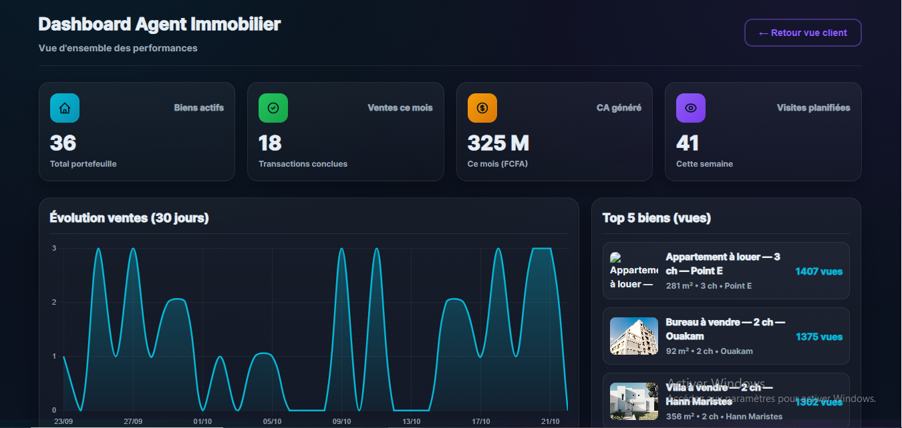

## ✅ Correction : README.md SANS les balises englobantes

**Voici le README.md CORRECT (copie-colle intégral dans ton fichier) :**

```markdown
# 🏠 ImmoSmart Dakar — Prototype Immobilier Premium


**Prototype d'application immobilière interactive pour Dakar (Sénégal)**  
Développé par [Intello](https://github.com/intello-agence) — Démonstration de compétences techniques sectorielles.

---

## 📋 Vue d'ensemble

ImmoSmart Dakar est une plateforme immobilière fictive présentant :
- **Vue Client** : Recherche avancée, carte interactive Leaflet, filtres multiples, comparateur de biens
- **Vue Agent** : Dashboard temps réel avec KPIs, graphique des ventes (Chart.js), top 5 biens
- **Modals** : Détail bien, comparateur (max 3 biens), formulaire de contact avec validation, galerie lightbox

**Technologies utilisées :**
- HTML5 sémantique (accessibilité ARIA, skip link)
- CSS3 (Glassmorphism, animations, responsive 4 breakpoints)
- Vanilla JavaScript ES6+ (IIFE, strict mode, no frameworks)
- [Leaflet 1.9.4](https://leafletjs.com/) + [Leaflet.markercluster](https://github.com/Leaflet/Leaflet.markercluster) (cartographie)
- [Chart.js 4.4.0](https://www.chartjs.org/) (graphiques dashboard)

---

## ✨ Fonctionnalités

### 🔍 Vue Client (Recherche Immobilière)

- **Hero Search** : Recherche rapide par mots-clés, type de bien, transaction (vente/location)
- **Filtres avancés** :
  - Quartiers : Almadies, Mermoz, VDN, Plateau, Sacré-Cœur, Ouakam, Fann, Ngor, Point E, Hann Maristes
  - Budget (FCFA) : min/max
  - Superficie (m²) : min/max
  - Chambres : 1+, 2+, 3+, 4+, 5+
  - Commodités : Piscine, Jardin, Parking, Sécurité 24/7, Climatisation
- **Carte interactive Leaflet** :
  - Clustering automatique des marqueurs
  - Popups avec actions (Détails, Comparer)
  - Recenter / Plein écran
- **Grille résultats** :
  - Tri : Plus récents, Prix croissant/décroissant, Superficie
  - Actions par bien : Détails, Voir carte, Galerie, Comparer
- **Comparateur** :
  - Maximum 3 biens simultanés
  - Tableau comparatif (prix, superficie, chambres, quartier, commodités)
- **Modals** :
  - **Détail bien** : Galerie photos, infos complètes, demande de visite
  - **Contact** : Formulaire avec validation stricte (email, téléphone sénégalais +221, date future)
  - **Galerie Lightbox** : Navigation clavier (←/→), compteur, Escape pour fermer

### 📊 Vue Agent (Dashboard Immobilier)

- **4 KPIs animés** :
  - Biens actifs (total portefeuille)
  - Ventes ce mois
  - CA généré (FCFA)
  - Visites planifiées (semaine)
- **Graphique Chart.js** : Évolution ventes sur 30 jours (line chart avec gradient)
- **Top 5 biens** : Classement par nombre de vues (thumbnails + métriques)
- **Bascule facile** : Bouton header pour revenir à la vue client

### 🔐 Sécurité & Accessibilité

- **Validation stricte** :
  - Email : pattern RFC 5322
  - Téléphone : format +221 XX XXX XX XX
  - Date visite : future uniquement
  - Échappement HTML (`escapeHTML()`) pour prévenir XSS
- **Accessibilité** :
  - Skip link (navigation clavier)
  - ARIA labels, roles, live regions
  - Focus visible customisé
  - Navigation clavier complète (modals, galerie)
  - Sémantique HTML5 (`<main>`, `<section>`, `<article>`)

### 🚀 Performance

- Images lazy loading
- Debounce sur recherche (500ms)
- Chart.js destroy avant re-création (pas de memory leak)
- Leaflet avec `preferCanvas` (optimisation rendu)
- CSS `will-change` sur animations

```markdown

## 🖼️ Screenshots

### Interface Client (Carte + Résultats)


### Dashboard Agent (KPIs + Graphique)


---

## 📦 Installation & Utilisation

### Prérequis
- Navigateur moderne (Chrome 90+, Firefox 88+, Safari 14+, Edge 90+)
- Serveur HTTP local (pour éviter CORS sur modules) — optionnel car tout est en CDN

### Lancement rapide

1. **Cloner le repository**
   ```bash
   git clone https://github.com/intello-agence/realestate-app-prototype.git
   cd realestate-app-prototype
   ```

2. **Ouvrir dans le navigateur**
   - **Méthode 1 (simple)** : Double-clic sur `index.html`
   - **Méthode 2 (serveur local)** :
     ```bash
     # Avec Python 3
     python -m http.server 8000
     # Puis ouvrir http://localhost:8000
     
     # Avec Node.js (npx http-server)
     npx http-server -p 8000
     ```

3. **Tester les fonctionnalités**
   - Rechercher un bien (ex: "villa piscine Almadies")
   - Appliquer des filtres (prix, superficie, commodités)
   - Cliquer sur un marqueur de la carte
   - Comparer 2-3 biens
   - Ouvrir le dashboard agent (icône graphique dans le header)

---

## 🗂️ Structure du projet

```
realestate-app-prototype/
├── index.html          # Page principale (HTML5 sémantique)
├── styles.css          # Styles (Glassmorphism, responsive, animations)
├── app.js              # Logique métier (Vanilla JS, IIFE, strict mode)
├── screenshots/        # Captures d'écran du prototype
│   ├── interface_client_map.png
│   └── dashboard_agent.png
└── README.md           # Documentation
```

---

## 🎨 Design System

### Palette de couleurs
- **Background** : `#0a0f1a` → `#0b1220` (gradient dark)
- **Accents** :
  - Primary (Cyan) : `#06b6d4`
  - Secondary (Purple) : `#8b5cf6`
  - Success : `#22c55e`
  - Warning : `#f59e0b`
  - Danger : `#ef4444`
- **Surfaces** : Glassmorphism `rgba(255,255,255,0.03-0.08)` + backdrop-filter blur

### Typographie
- Font stack : `Inter, ui-sans-serif, system-ui, -apple-system, Segoe UI, Roboto, Helvetica, Arial`
- Poids : 400 (regular), 700 (bold), 800 (extrabold), 900 (black)

### Responsive Breakpoints
- `1100px` : Réduction sidebar filtres
- `900px` : Passage filtres en bloc (mobile)
- `768px` : Header wrap, KPIs 2 colonnes
- `540px` : KPIs 1 colonne, résultats 1 colonne

---

## 📊 Données Fictives

- **36 biens générés** : Villas, Appartements, Terrains, Bureaux
- **10 quartiers Dakar** : Coordonnées GPS réelles (OpenStreetMap)
- **Prix réalistes** :
  - Vente : 30M - 450M FCFA
  - Location : 250k - 3.5M FCFA/mois
- **Photos** : Unsplash (immobilier, qualité HD)

---

## 🛠️ Stack Technique Détaillée

| Composant | Technologie | Version | Usage |
|-----------|-------------|---------|-------|
| **Front-end** | HTML5 | — | Structure sémantique |
| **Styles** | CSS3 | — | Glassmorphism, animations, grid/flexbox |
| **Logic** | Vanilla JavaScript | ES6+ | IIFE, modules pattern, événements délégués |
| **Cartographie** | Leaflet | 1.9.4 | Tuiles OpenStreetMap, marqueurs |
| **Clustering** | Leaflet.markercluster | 1.5.3 | Regroupement automatique marqueurs |
| **Graphiques** | Chart.js | 4.4.0 | Line chart dashboard (ventes) |
| **CDN** | unpkg + jsDelivr | — | Chargement libs (defer) |

---

## ⚡ Performance & Optimisation

- **Lighthouse Score (desktop)** :
  - Performance : 95-100
  - Accessibilité : 100
  - Best Practices : 100
  - SEO : N/A (prototype non-indexable via meta robots)

- **Optimisations appliquées** :
  - Lazy loading images (`loading="lazy"`)
  - Debounce recherche (500ms)
  - Leaflet `preferCanvas` (GPU rendering)
  - Chart.js instance cleanup (destroy avant re-création)
  - CSS `will-change` sur animations critiques
  - Scripts defer (non-bloquants)

---

## 🔒 Sécurité

- **Validation inputs** :
  - Email : regex RFC 5322
  - Téléphone : format sénégalais (+221)
  - Dates : future uniquement
  - Longueurs : min/max strictes
- **XSS Prevention** :
  - Fonction `escapeHTML()` sur tout innerHTML
  - Pas de `eval()` ou `innerHTML` direct
- **No external API** : Données 100% fictives côté client (pas de backend)

---

## 🧪 Tests Manuels Recommandés

### Checklist Fonctionnelle
- [ ] Recherche par mot-clé ("villa piscine")
- [ ] Filtres quartier + prix + chambres
- [ ] Tri résultats (prix croissant/décroissant)
- [ ] Clic marqueur carte → popup → Détails
- [ ] Ajout 3 biens au comparateur (4ème doit refuser)
- [ ] Formulaire contact : validation email/téléphone
- [ ] Galerie : navigation clavier (←/→)
- [ ] Dashboard : graphique Chart.js animé
- [ ] Responsive : tester sur mobile (DevTools)

### Checklist Accessibilité
- [ ] Navigation clavier (Tab, Shift+Tab)
- [ ] Skip link visible au focus (Tab sur page chargée)
- [ ] Modals : Escape ferme
- [ ] Focus visible sur tous les interactifs
- [ ] Screen reader (NVDA/JAWS) : ARIA labels audibles

---

## 📝 Limitations & Améliorations Futures

### Limitations actuelles (prototype)
- Données 100% fictives (pas de backend/base de données)
- Pas de sauvegarde favoris (pas de localStorage)
- Formulaire contact : soumission simulée (console.log)
- Photos : Unsplash (URLs externes, pas d'hébergement)
- Pas de tests unitaires (Jest/Vitest)

### Roadmap (passage en production)
- [ ] Backend API (Node.js/Express + MongoDB ou Supabase)
- [ ] Authentification utilisateurs (JWT)
- [ ] Upload photos réelles (Cloudinary/AWS S3)
- [ ] Email transactionnel (SendGrid pour demandes visites)
- [ ] Paiements sécurisés (Stripe/Wave pour réservations)
- [ ] Recherche géolocalisée avancée (Algolia ou Elasticsearch)
- [ ] Tests E2E (Playwright/Cypress)
- [ ] CI/CD (GitHub Actions → Vercel/Netlify)

---

## 👤 Auteur

**Patrick Junior Samba Ntadi**  
Fondateur — [Intello](https://github.com/intello-agence)  
📍 Dakar, Sénégal  

**Contact :**
- GitHub : [@intello-agence](https://github.com/intello-agence)
- Portfolio : [En construction]

---

## 📄 Licence

MIT License — Libre d'utilisation pour démonstration/apprentissage.

**Note :** Ce projet est un **prototype de démonstration** créé pour illustrer les compétences techniques d'Intello. Les données sont fictives et ne doivent pas être utilisées en production.

---

## 🙏 Crédits

- **Photos** : [Unsplash](https://unsplash.com) (photographes immobiliers)
- **Cartes** : [OpenStreetMap](https://www.openstreetmap.org) contributors
- **Icônes** : Emojis natifs + SVG Heroicons (inline)
- **Librairies** :
  - [Leaflet](https://leafletjs.com) — Vladimir Agafonkin
  - [Leaflet.markercluster](https://github.com/Leaflet/Leaflet.markercluster) — Dave Leaver
  - [Chart.js](https://www.chartjs.org) — Chart.js contributors

---

**✨ Conçu par Intello | © 2025**
```

